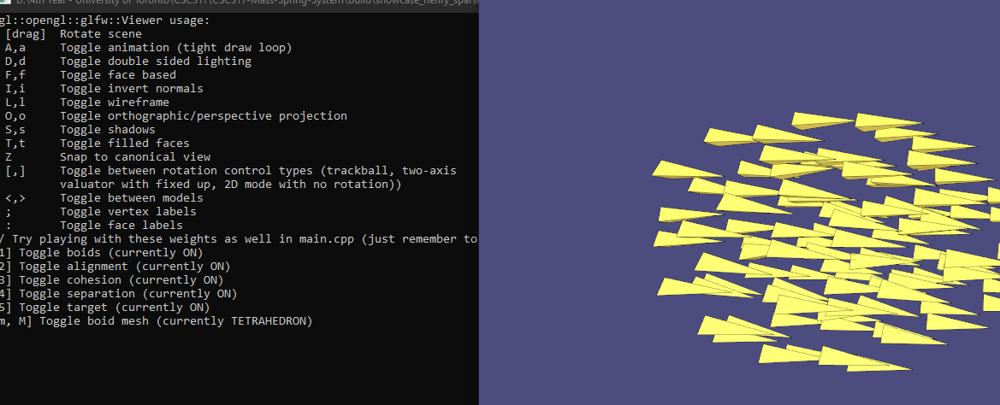

# Title: Attack of the Boids

**Author:** Henry Chen - chenhe33 - 1008909308  
**Augmented:** A8 (Mass-springs)

---

## How to run the code

> Note: This is basically just the regular instructions for A8. These are the instructions to compile on Windows - which I've tested. For other platforms, follow the usual assignment instructions (see A1) and it should still work.

### Compilation

1. clone this github: `git clone --recursive https://github.com/LatinScribe/CSC317-Showcase---Attack-of-the-Boids-Public.git`

  Starting in the root directory, issue:  
  ```bash
  mkdir build
  cd build
  cmake ..
  ```

  If you are using Windows, then running `cmake ..` should have created a Visual Studio solution file called `showcase_henry.sln` that you can open and build from there. Building the raster project will generate an .exe file (`showcase_henry_sparse.exe`). I recommend building using "Release".

### Running the assignment

Assuming your .exe file is in the `/build` folder, in the `/build` folder, run the .exe file with `./showcase_henry_sparse`.

As printed, you can use 1,2,3,4,5, and "m" keys as toggles once the program is running.

I recommend toggling off 5 first (target seeking) while trying the other toggles (otherwise toggling the others might be hard to see). You'll see:

- Toggle 1: hide boids, self explanatory.
- Toggle 2: this will make the boids not align themselves in a common axis (start pointing everywhere)
- Toggle 3: They will lose cohesion and be less grouped together
- Toggle 4: They will no longer avoid coliding together - so the boids will clump up
- Toggle 5: The boids will stop/start following the cursor (the global target).
- Toggle m: I tried to make a nice bird mesh, but it still needs work...

The other default viewer toggles should generally still work as in A8. Use scroll to zoom out, click and drag to pan!


---

## Description of Project

In the Textbook (Fundamentals of Computer Graphics, 4th Edition), if you keep reading Chapter 16 past the assigned readings (from A8), you will come accross section 16.7 which describes animating *Groups of Objects*. Specifically, we focus the emergent behavior of flocking, where the motion of a group member (called a *boid*) in relation to just a few of its closest nieghbours can be used to exihbit *coordinated goal-driven motion* (Reynolds, 1987). A copy of the original paper can be found on the DCS website: https://www.cs.toronto.edu/~dt/siggraph97-course/cwr87/

### Key features:

- General boid class representation (you can change the mesh associated by pressing "m")
- Each boid is influenced by the target, cohesion, alignment, and separation forces (clamped) - notice that just comparing with a fixed number of neighbours (fixed cost) is sufficient to produce our global behavior. 
- Flock animated using OpenGl viewer.
- use 1,2,3,4,5 to toggle the different influences to see the effects. "m" for different boid mesh. 

### Key files:

- src/boid.cpp - Implements the boid class
- include/boid.h - Header file for boid class
- main.cpp - Animation file (you can play with global variables here)
- CMakeList.txt - basically just A8, but with some changes
- Readme.md - You're reading it right now!
- piece.mp4 - Demo of project

Note: Other files are essentially unchanged from A8 starter code so you can see how it fits in. 

---

## Acknowledgements

- Textbook - Fundamentals of Computer Graphics, 4th Edition (Steve Marschner, Peter Shirley)
- Original Paper - Reynolds, 1987: https://www.cs.toronto.edu/~dt/siggraph97-course/cwr87/
- Also referenced this helpful guide (By Thomas Rouch) to understand the key concepts, particularly the math for Alignment, Seperation, and Cohesion: https://medium.com/better-programming/mastering-flock-simulation-with-boids-c-opengl-and-imgui-5a3ddd9cb958
- I used the same external libraries as A8, particularly OpenGL (libigl).
- I also asked ChatGPT for some help with conceptual questions, particularly when writing the OpenGL viewer.
